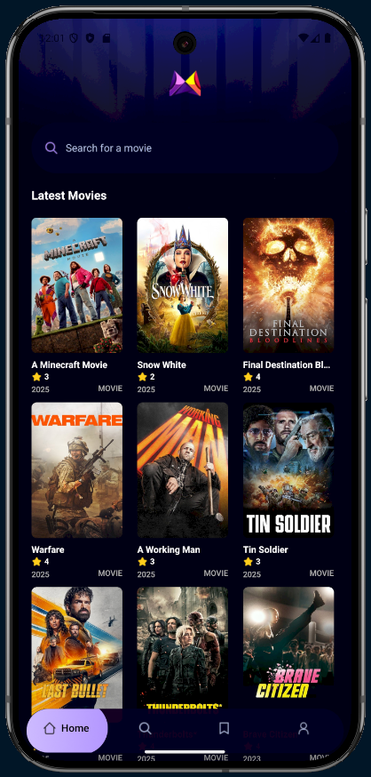
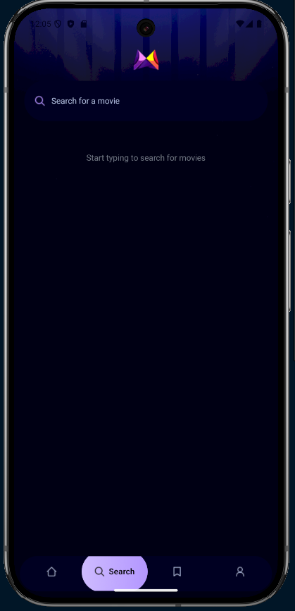
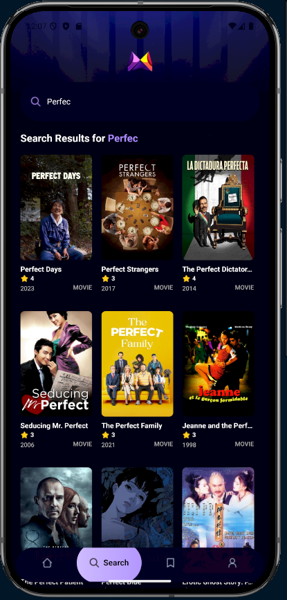
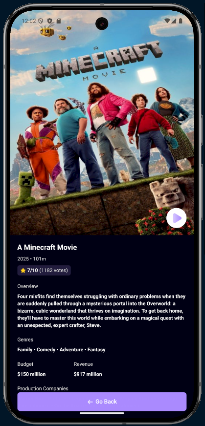

<!DOCTYPE html>
<html lang="en">
<head>
  <meta charset="UTF-8" />
  <meta name="viewport" content="width=device-width, initial-scale=1.0" />
</head>
<body>
  <header>
    <h1>Movie Explorer App</h1>
    
A modern mobile application for discovering and exploring movies, built with React Native and Expo.

  </header>

  <section>
    <h2>✨ Features</h2>
    <ul>
      <li><strong>🎬 Movie Discovery</strong>: Browse trending movies in a beautiful grid layout with high-quality posters.</li>
      <li><strong>🔍 Smart Search</strong>: Find movies by title with debounced search functionality for optimal performance.</li>
      <li><strong>📱 Responsive Design</strong>: Fully responsive layout that works on all mobile device sizes.</li>
      <li><strong>🎨 Custom UI</strong>: Beautiful animated tab navigation and carefully crafted user interface.</li>
      <li><strong>📊 Detailed Views</strong>: Comprehensive movie details including ratings, reviews, and production info.</li>
    </ul>
  </section>

  <section>
    <h2>🛠 Technologies Used</h2>
    
React Native, Expo, TypeScript, Tailwind CSS(via NativeWind), TMDB API, Expo Router

  </section>

  <section>
    <h2>🚀 Installation</h2>
    <ol>
      <li>Clone the repository:
        <pre><code>git clone https://github.com/MohamedAmineNasri/Movie_App.git
cd mobile</code></pre>
      </li>
      <li>Install dependencies:
        <pre><code>npm install
# or
yarn install</code></pre>
      </li>
      <li>Set up environment variables:
        
Create a <code>.env</code> file in the root directory with your TMDB API key:

        <pre><code>EXPO_PUBLIC_MOVIE_API_KEY=your_tmdb_api_key_here</code></pre>
      </li>
      <li>Run the app:
        <pre><code>npx expo start
# or
yarn expo start</code></pre>
      </li>
    </ol>
  </section>

  <section>
    <h2>📂 Project Structure</h2>
    <pre>
/mobile
    /components
        MovieCard.tsx      # Movie grid item component
        SearchBar.tsx      # Search input component
    /constants
        icons.ts           # App icon assets
        images.ts          # App image assets
    /services
        api.ts             # TMDB API service
        useFetch.ts        # Custom fetch hook
    /app
    (tabs)               # Tab navigation
        index.tsx          # Home screen
        search.tsx         # Search screen
        saved.tsx          # Saved movies screen
        profile.tsx        # User profile screen
    movie/[id].tsx       # Movie details screen
    </pre>
  </section>

  <section>
  <h2>📱 Screens</h2>

  <h3>Home Screen</h3>
  <ul>
    <li>Displays trending movies in a grid layout</li>
    <li>Features a search bar to navigate to search screen</li>
  </ul>
  

  <h3>Search Screen</h3>
  <ul>
    <li>Full-text search functionality</li>
    <li>Debounced search requests</li>
    <li>Results displayed in 3-column grid</li>
  </ul>
  
<strong>Before typing:</strong>

  
  
<strong>After typing:</strong>

  

  <h3>Movie Details Screen</h3>
  <ul>
    <li>Detailed movie information</li>
    <li>High-quality poster image</li>
    <li>Metadata including:
      <ul>
        <li>Release year</li>
        <li>Runtime</li>
        <li>Rating</li>
        <li>Overview</li>
        <li>Genres</li>
        <li>Budget and revenue</li>
        <li>Production companies</li>
      </ul>
    </li>
  </ul>
  

  <h3>Saved & Profile Screens</h3>
  
Placeholder screens for future functionality

</section>

  <section>
    <h2>🪝 Custom Hooks</h2>
    <h3><code>useFetch</code></h3>
    
A reusable hook for API requests that handles:

    <ul>
      <li>Loading states</li>
      <li>Error handling</li>
      <li>Data caching</li>
      <li>Automatic/manual refetching</li>
    </ul>
  </section>

  <section>
    <h2>🔌 API Integration</h2>
    
The app uses the TMDB (The Movie Database) API for:

    <ul>
      <li>Fetching trending movies (<code>/discover/movie</code>)</li>
      <li>Searching movies (<code>/search/movie</code>)</li>
      <li>Getting movie details (<code>/movie/{id}</code>)</li>
    </ul>
  </section>

  <section>
    <h2>🎨 Styling</h2>
    
The app uses Tailwind CSS via NativeWind for styling, with:

    <ul>
      <li>Dark color scheme</li>
      <li>Custom accent colors</li>
      <li>Responsive layouts</li>
      <li>Animated tab bar</li>
    </ul>
  </section>
</body>
</html>
